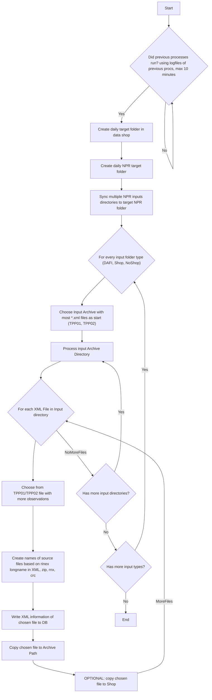

# service-rinexsynchronizer

Synchronizes NPR and rinex data from 2 sources to one destination

## Summary

The service is designed to synchronize NPR and rinex data from 2 sources to one destination.
It decides which is the more complete file based on the rinex metadata (service-rinexmetadatacontroller).
All configuration parameters are listed in the configuration file App.config.

## Dependencies

Prerequisites for development:
  * c# .Net Framework 4.5
  * System.Data.SQLite.Core -Version 1.0.111 (The official SQLite database engine for both x86 and x64 along with the ADO.NET provider.)
  
To get the System.Data.SQLite.Core Package use nuget.
PM> Install-Package System.Data.SQLite.Core -Version 1.0.111

## Flowchart
### Processing a single day of a single input directory

